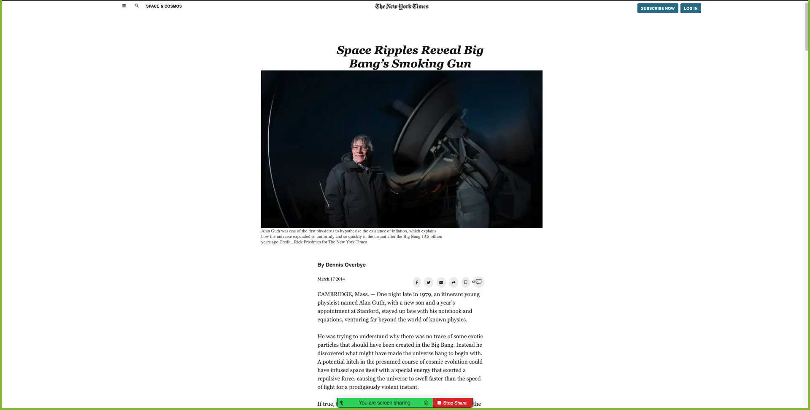
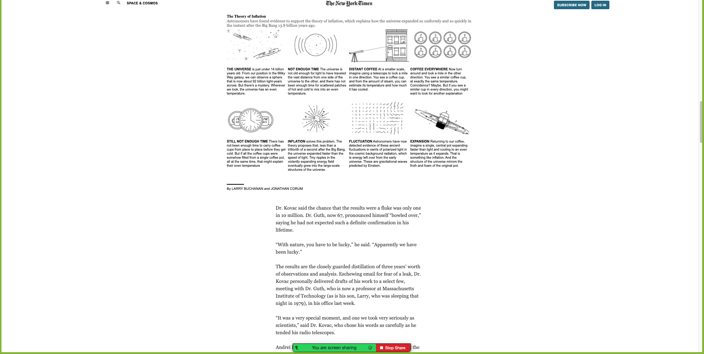
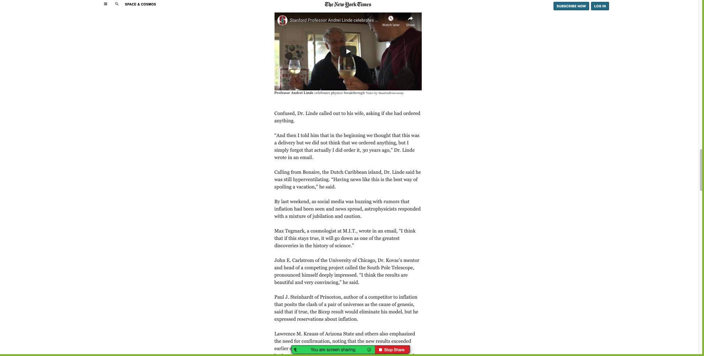
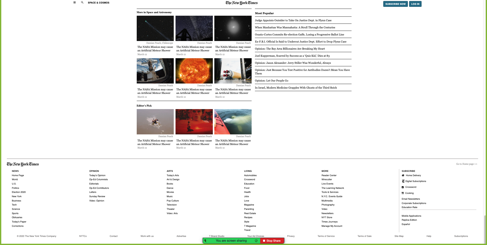

# New-York-Times-Article

This HTML form page is designed with basic HTML, CSS, Grid, FlexBox and Positioning features. Fontawsome icons are used.

# Original Design

For the original design: [www.nytimes.com](https://www.nytimes.com/2014/03/18/science/space/detection-of-waves-in-space-buttresses-landmark-theory-of-big-bang.html?_r=0)

# Project Design

For the project design: 

# Github link:

For the: [Github-link](https://github.com/Georjane/New-York-Times-Article)

# Main sections

## Navigation row

Grid system features are used with vertical alignment.

## Body section

Article, list elements, embed video & images are used with a grid system layout.

## Footer

Grid system layout and flex boxes are used with necessary alignments.

# Technologies Used:

- HTML
- CSS
- Grid System
- Flex Box
- Fontawsome icons

# Authors:

## Witah Ngu Geojane

- Github: https://github.com/Georjane
- LinkedIn: https://www.linkedin.com/in/witah-georjane-74b8bb184
- Twitter: https://twitter.com/WittyJany

## Yiğit Mersin

- Github: https://github.com/yigitm
- Linkedin: https://www.linkedin.com/in/yigitmersin
- Twitter: https://twitter.com/ygtmrsn
